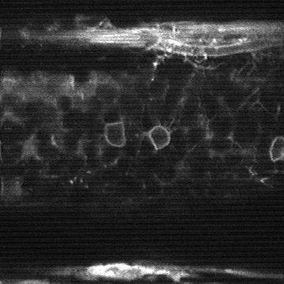

# JPP_review_code_2020

This is the repository for the open-source code described in
[Mannam, Varun, Yide Zhang, Xiaotong Yuan, Cara Ravasio, and Scott Howard. "Machine learning for faster and smarter fluorescence lifetime imaging microscopy." Journal of Physics: Photonics (2020).](https://iopscience.iop.org/article/10.1088/2515-7647/abac1a)

```latex
@article{mannam2020machine,
  title={Machine learning for faster and smarter fluorescence lifetime imaging microscopy},
  author={Mannam, Varun and Zhang, Yide and Yuan, Xiaotong and Ravasio, Cara and Howard, Scott},
  journal={Journal of Physics: Photonics},
  year={2020},
  publisher={IOP Publishing}
}
```

# Lifetime denoising using pretrained Noise2Noise-NBN model:

#Images: The lifetime images used in the inference stage can be downloaded from here https://curate.nd.edu/show/mw22v40954f

#Citation for dataset: Please cite the FMLD dataset using the following format: 
Mannam, Varun. “Fluorescence Microscopy Lifetime Denoising (FMLD) Dataset.” Notre Dame, January 1, 2020. https://doi.org/10.7274/r0-18da-9m58.

# Code is available here: 
https://github.com/ND-HowardGroup/Lifetime_denoising_JPP

# Results: 
   

#########################################################
# Estimation of lifetime from intensity

#Images: The training and test dataset can be downloaded from here https://curate.nd.edu/show/jd472v2759b

#Citation for dataset: Please cite the LFI dataset using the following format: Mannam, Varun. “Lifetime From Intensity (LFI) Dataset.” Notre Dame, August 13, 2019. https://doi.org/10.7274/r0-ac46-ft93.

# Code is available here: 
https://github.com/ND-HowardGroup/Poster_code_Fall19

# Results: 
   

#########################################################


## License & Copyright
© 2020 Varun Mannam, University of Notre Dame

Licensed under the [Apache License 2.0](https://github.com/ND-HowardGroup/JPP_review_code_2020/blob/master/LICENSE.txt)
